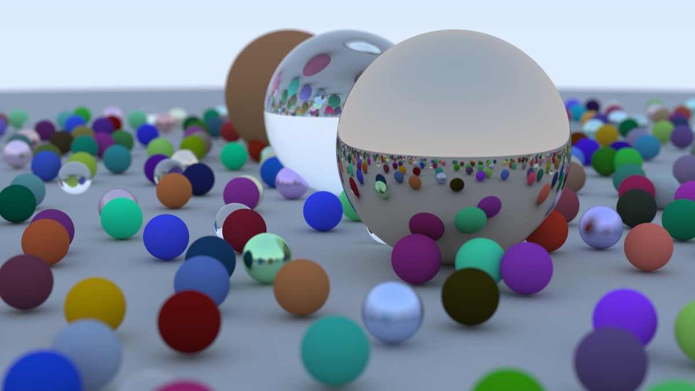
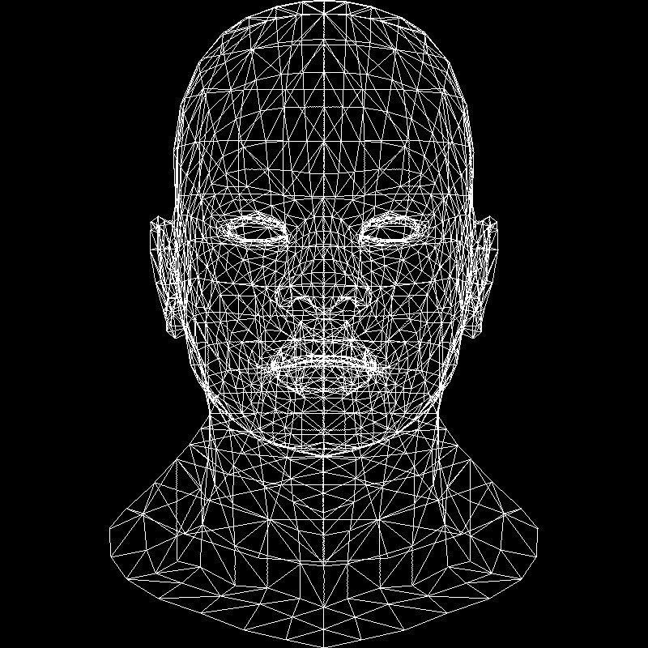
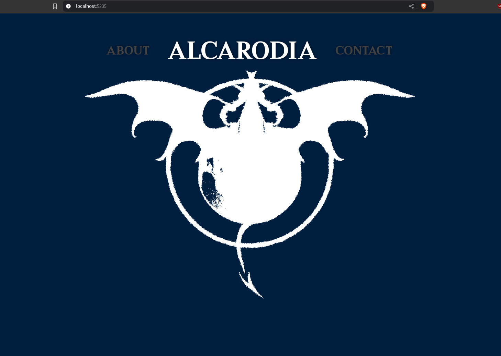

# Area 52

A personal space to save my codecrafters' projects. The goal of all this is the experience.

Sources: https://app.codecrafters.io/catalog   ||   https://github.com/codecrafters-io/build-your-own-x

***Codecrafters is a compilation of well-written, step-by-step guides for re-creating our favorite technologies from scratch.***

# Projects

---

**P001:** My own Redis

---

**P002:** Ray Tracing in One Weekend 

---

**P003:** How OpenGL Works 

---

**P004:** Quick .NET Blazor Website Prototype  

---

---
